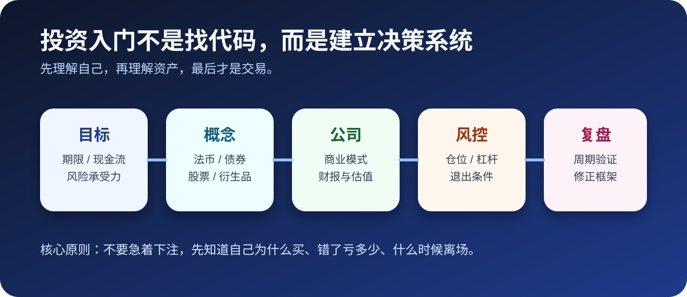
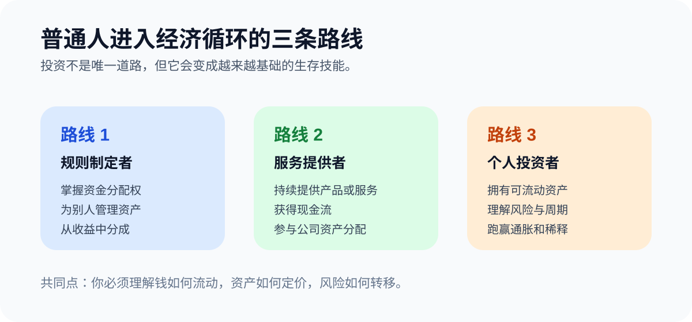
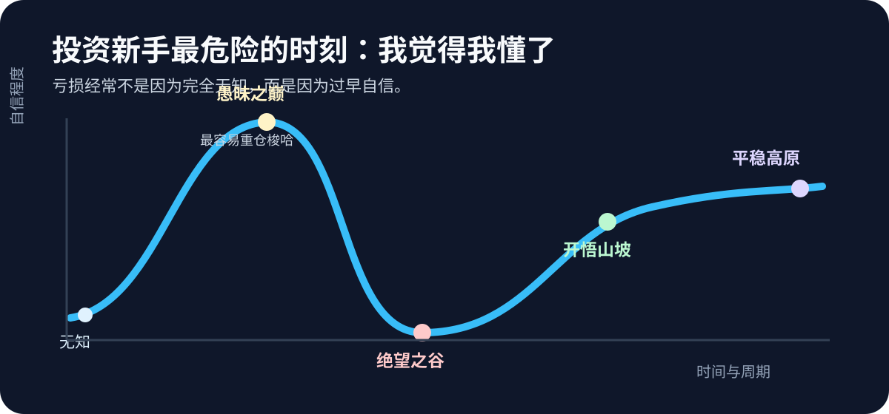

# Investing for Beginners

[中文原文](../../guides/投资入门指南.md) | [English Home](../README.md)

Version: V0.2

Author: Xu Chonglang

## Why ordinary people need to learn investing

Most people earn money through labor, but long-term life goals require more than monthly income: housing, retirement, family obligations, healthcare, education, and the ability to survive unexpected shocks.

Holding cash is also a financial decision. Buying property is a financial decision. Participating in a pension plan is a financial decision. Even doing nothing is a financial decision, because inflation and currency debasement still affect purchasing power.

Learning investing does not mean becoming a professional trader. It means developing the ability to understand financial products, identify risk, avoid obvious traps, and take responsibility for your own capital.

The real beginner path has three layers:

1. Learn how to allocate money by goal, time horizon, and risk tolerance.
2. Understand compounding, diversification, transaction cost, liquidity, and maximum loss.
3. Use discipline and review to replace emotional chasing and panic selling.

## Three economic routes

There are many ways to stay inside the economic cycle:

1. Become a capital allocator: help other people manage money and share part of the return.
2. Become a valuable service provider: create products, services, or companies that generate recurring cash flow.
3. Become a capable individual investor: own liquid assets and learn how to make them survive inflation, cycles, and technological change.

Investing is not the only route, but it increasingly becomes a basic skill behind all three.

## The beginner trap

New investors usually face too much information before they have a framework.

They see screenshots of profits, macro opinions, stock picks, crypto narratives, options trades, and confident influencers. The natural reaction is to outsource judgment: follow someone, buy what looks exciting, then sell when the same person changes tone.

That is not investing. That is borrowing someone else's conviction without borrowing their risk tolerance, portfolio size, hedges, time horizon, or exit plan.

The first rule is simple: do not rush to prove that you are right. You only need to be responsible for your own result.

## The dangerous sentence: “I think I understand it”

The most dangerous period for beginners is not complete ignorance. It is early confidence.

A person learns a few concepts, makes a profitable trade, and suddenly believes the market is easy. This is where excessive leverage, oversized positions, and concentrated bets usually appear.

A realistic beginner should assume:

- one profitable trade does not validate a framework;
- one bull market does not prove skill;
- one correct thesis does not remove position risk;
- one popular narrative can still be overpriced.

It usually takes years, not weeks, to build a durable investing framework.

## What to learn first

Before focusing on individual stocks or crypto assets, a beginner should understand four basic asset layers:

1. Fiat money: purchasing power, interest rates, exchange rates, and inflation.
2. Bonds: duration, yield, credit risk, and how interest rates affect asset prices.
3. Stocks: ownership, cash flow, valuation, dilution, and business quality.
4. Derivatives: leverage, time value, volatility, margin, and maximum loss.

You do not need to trade every asset class. But you should know how they connect.

For stock investing, the core question eventually becomes:

> What is this company worth, why might that value change, and what does the market currently price in?

## Technical analysis and probability

Technical analysis is not magic. It is a way to organize market behavior and probability.

Some tools may be useful in specific conditions: candlesticks, trend structure, moving averages, Wyckoff-style accumulation and distribution, momentum, Fibonacci levels, VWAP, liquidity zones, and price action.

But no technical tool works 100% of the time. If a method cannot be falsified or can always explain itself after the fact, treat it with caution.

Investing is a probability game, not a proof game.

## The essence of investing

Investing is patience, probability, and position sizing.

Before entering a position, you should be able to answer:

1. Why am I buying?
2. What would prove me wrong?
3. How much can I lose if I am wrong?
4. What would make me add, reduce, or exit?
5. Is this an investment, a trade, or pure speculation?

The hardest part is not clicking the buy button. The hardest part is knowing when your odds are good enough, how much size to use, and when to leave.

## On speculation

Small accounts often feel pressure to take more risk. That pressure is real, but leverage does not become safe just because the account is small.

Speculation can be part of learning, but it should be treated honestly:

- it needs outside cash flow support;
- it can go to zero;
- it should not be confused with a repeatable investment framework;
- it must not destroy your ability to keep learning.

The larger the capital base, the more important the first rule becomes: avoid permanent loss.

## Market cycles and exiting

Every asset has cycles.

A good company can still become overpriced. A strong sector can still mean-revert. A great story can still trap late buyers.

Useful exit signals include:

- people far from the market suddenly discussing the same asset;
- trading groups becoming emotionally euphoric and one-sided;
- a stock or sector doubling quickly without enough fundamental re-pricing to support it;
- your original thesis already being fully priced in;
- your position size becoming larger than your risk plan.

You do not need to sell the exact top. You need to avoid becoming the last buyer of the best story.

## The simplest shortcut

For most people, the closest thing to an investing shortcut is long-term, disciplined index investing, such as regularly buying a broad U.S. equity index fund.

It is boring, but boredom is often underrated. Many exciting strategies fail because they cannot scale, cannot survive cycles, or require timing precision most people do not have.

If you do not choose the boring path, at least understand what you are giving up: simplicity, diversification, and time-tested survivability.

## Summary

Investing is simple in wording but difficult in behavior:

- buy assets you can understand;
- avoid leverage you cannot survive;
- do not chase after euphoria;
- know your position size;
- define your exit before emotions take over;
- keep reviewing your framework.

The goal is not to win every trade. The goal is to build a system that can survive long enough for skill, patience, and compounding to matter.
